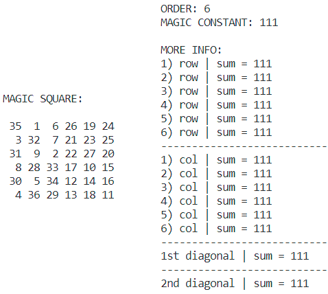

# Magic Square generator ✨
### Theory
A <b>Magic square</b> is a square array <i>n×n</i> filled with <i>n²</i> different numbers in such a way that the sum of the numbers in each row, each column and on both diagonals is the same.

If the array includes just the positive integers <i>1, 2, ..., n²</i> the magic square is said to be <b>normal</b>.

 * <b>Order</b> is the number of integers along one side <i>n</i>;
 * <b>Magic constant</b> is the sum of the numbers in each row, column and on the diagonals, depends only on <i>n</i> and is determined by the formula <i>n×(n²+1)/2</i>.
 
 Normal magic squares exist for all orders of <i>n>=1</i>, with the exception of <i>n=2</i>, although the case of <i>n=1</i> is trivial - the square consists of a single number.
 
This class is an implementation of a normal magic square.

------------


### Examples
```java
 // Creating a class object (size n)
 MagicSquare square = new MagicSquare(n);
 
 // Get the order value
 square.getOrder();
 
 // Get the magic constant value
 square.getMagicConstant();
 
 // Displaying the elements of the magic square on the screen
 for (int i = 0; i < square.getOrder(); i++) {
     for (int j = 0; j < square.getOrder(); j++) {
         System.out.print(square.getBody()[i][j] + " ");
     }
     System.out.println("");
 }
```

------------
### Results

------------

### References to the sources used
- [Definition](https://en.wikipedia.org/wiki/Magic_square "Definition")
- [Odd Magic Squares | Algorithm](https://www.1728.org/magicsq1.htm "Odd Magic Squares | Algorithm")
- [Doubly Even Magic Squares | Algorithm](https://www.1728.org/magicsq2.htm "Doubly Even Magic Squares | Algorithm")
- [Singly Even Magic Squares | Algorithm](https://www.1728.org/magicsq3.htm "Singly Even Magic Squares | Algorithm")

------------

